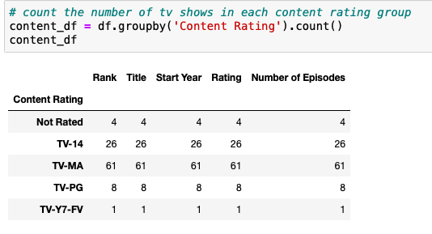
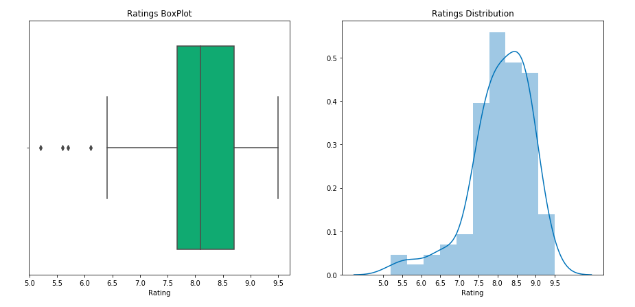
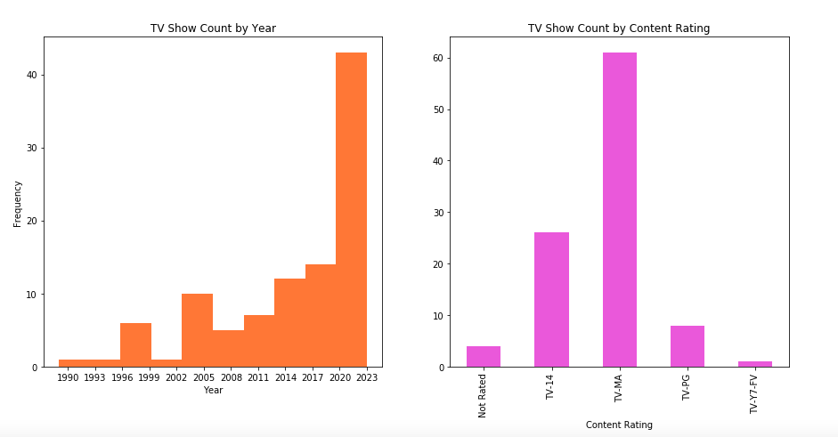
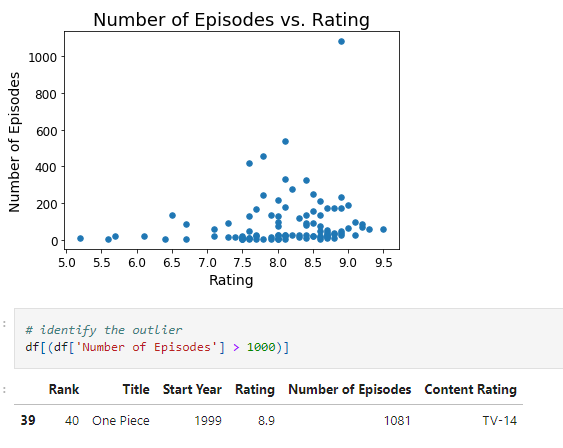
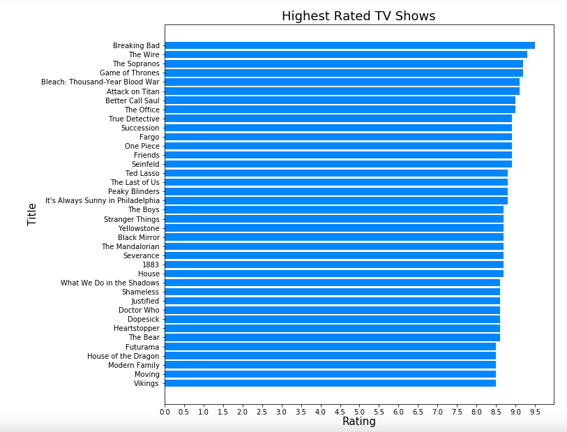
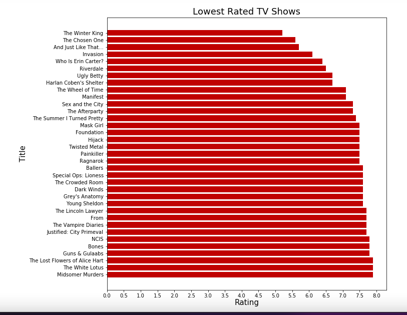

# IMDb-Web-Scraping
Web Scraping and EDA Project
## Table of contents
* [Introduction](#introduction)
* [Technologies](#technologies)
* [Goal](#goal)
* [Dataset](#dataset)
* [Methodology](#methodology)
* [Data Overview](#data-overview)
* [Exploratory Data Analysis](#exploratory-data-analysis)
## Introduction
Scraping the IMDb website for the Top 100 most popular TV shows today.
## Technologies
Python
## Goal
The goal for this analysis is to be able to scrape the IMDb website in order to import the Top 100 most popular TV shows today and to describe the data through visualizations. 
## Dataset
The data includes 100 observations and the following variables:
 
*Rank:* Position held by popularity 
 
*Title:* Name of TV show
 
*Start Year:* Year the TV show was released 
 
*Rating:* Star rating on a scale of 0-10 
 
*Number of Episodes:* Number of episodes in the Series 
 
*Content Rating:* Rating for suitability to target audience

## Methodology
1. *Import Data:* Inspected the IMDb website to access the html code in order to determine the location for the variables needed for analysis. A for loop was then created to insert the data into lists and then to a dataframe. Data values that were missing in the Rating and Content Rating columns were filled with ‘Not Available’ and ‘Not Rated’ respectively.  
## Data Overview
1. *Data Understanding and Data Cleaning:* Length of the data frame and types of the variables were determined to assure that data was imported correctly. Numeric values that were stored as object were converted to numeric. After the conversion, 2 values in the Rating column were converted to NaN. Since only 2 of 100 ratings were “missing”, the mean rating was used to fill the missing values. The group by operation was used to obtain the count of tv shows in each content rating group.  

  
## Exploratory Data Analysis
1. *Box Plot and Distribution Plot:* A box plot and a distribution plot was used to examine the distribution of Ratings. The distribution of ratings is slightly left skewed and 4 ouliers are identified in the box plot. The 4 outliers have a lower rating compared to the ratings in the dataset.
  
2. *Histogram and Bar Plot:* A histogram and bar plot were used to visualize the frequency of TV Shows by start year and content rating. The majority of the top 100 TV shows started in 2019 and above and have a content rating of TV-MA.
  
2. *Scatterplot:* Examined the relationship between the number of episodes and ratings. The scatterplot does not show a correlation between the two variables but a clear outlier is shown in the plot. The number 40 ranked show, "One Piece", has a high rating at 8.9 and a very high number of episodes at 1081.
  
3. *Highest Rated TV Shows:* TV shows with a star rating of 8.5 and above.
  
4. *Lowest Rated TV Shows:* TV shows with a star rating of below an 8.
  
