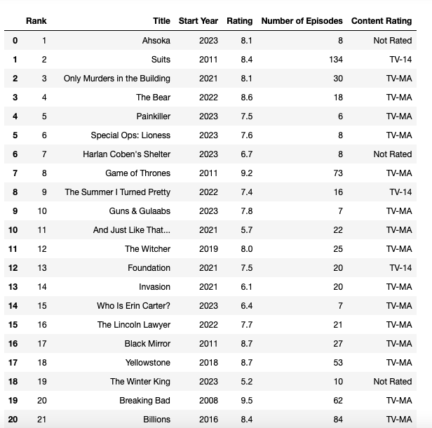
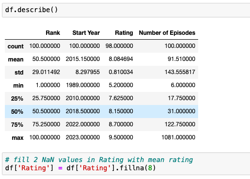

# IMDb-Web-Scraping
Web Scraping and Visualization Project
## Table of contents
* [Introduction](#introduction)
* [Technologies](#technologies)
* [Goal](#goal)
* [Dataset](#dataset)
* [Methodology](#methodology)
* [Data Overview](#data-overview)
* [Models Used](#models-used)
* [Visualizations](#visulaization)
## Introduction
Web Scraping the IMDb website for the Top 100 most popular TV shows today.
## Technologies
Python
## Goal
The goal for this analysis is to be able to scrape the IMDb website in order to import the Top 100 most popular TV shows today and to describe the data through visualizations. 
## Dataset
The data includes 100 observations and the following variables:
 
*Rank:* Position held by popularity 
 
*Title:* Name of TV show
 
*Start Year:* Year the TV show was released 
 
*Rating:* Star rating on a scale of 0-10 
 
*Number of Episodes:* Number of episodes in the Series 
 
*Content Rating:* Rating for suitability to target audience

## Methodology
1. *Import Data:* Inspected the IMDb website to access the html code in order determine the location for the variables needed for analysis. A for loop was then created in insert the data into lists and then to a dataframe. Data values that were missing in the Rating and Content Rating column were filled with ‘Not Available’ and ‘Not Rated’ respectively.  
## Data Overview
1. *Data Understanding and Data Cleaning:* Length of the data frame and types of the variables were determined to assure that data was imported correctly. Numeric values that were stored as object were converted. After the conversion, 2 values in the Rating column were converted to NaN. Since only 2 of 100 ratings were “missing”, the mean rating was used to fill the missing values.  
  
